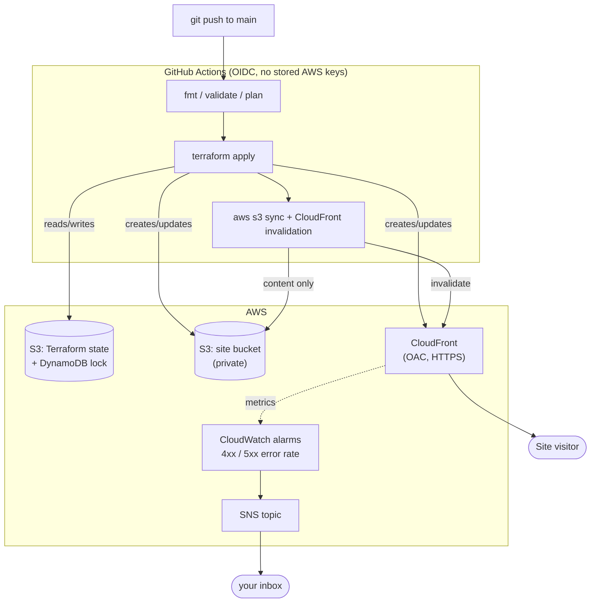

# Static Site: CI/CD Pipeline + Monitoring

A static site on S3 + CloudFront, deployed exclusively through a GitHub Actions pipeline that
runs Terraform for infrastructure and syncs content separately — with CloudWatch alarms and an
SNS topic watching it in production. This is the project that shows you understand the "day 2"
half of DevOps: how changes actually ship, and how you'd know if something broke.

## Architecture



## What this demonstrates

- **A real CI/CD pipeline for infrastructure**, not just app code — `fmt`/`validate`/`plan` on every push and PR, `apply` gated to `main`, remote state with locking so two runs can't corrupt each other.
- **Keyless CI → cloud authentication** — GitHub Actions assumes an IAM role via OIDC (`bootstrap/github_oidc.tf`), scoped by a trust-policy condition to this exact repo and branch. No AWS access keys live in GitHub secrets.
- **Least-privilege CI permissions** — the role's policy is scoped to specific resource ARNs wherever AWS's IAM model allows it (state bucket, lock table, `project_name`-prefixed S3 buckets, specific alarm/dashboard/topic ARNs), with the handful of exceptions that AWS genuinely doesn't support scoping (e.g. `cloudfront:CreateDistribution` has no ID yet) called out explicitly rather than papered over with a blanket `"*"`.
- **Separating infra changes from content changes** — Terraform owns the bucket/CDN/alarms; a plain `aws s3 sync` + cache invalidation ships new HTML on every commit without needing a Terraform apply for a copy edit.
- **Monitoring that's wired to something** — CloudWatch alarms on CloudFront's 4xx/5xx error rate publish to an SNS topic with an optional email subscription, plus a CloudWatch dashboard for a quick visual.
- **HTTPS with zero certificate management** — CloudFront's default certificate gives you TLS for free on the `*.cloudfront.net` domain; no ACM request/validation dance needed for a portfolio demo (that step is a documented extension below).

## Deploy

**One-time setup (run locally, before your first push):**

```bash
cd 03-static-site-cicd-monitoring/bootstrap
terraform init
terraform apply -var="github_repository=YOUR_GITHUB_USERNAME/YOUR_REPO_NAME"
# note the two outputs: state_bucket_name and github_actions_role_arn
```

Then:
1. Uncomment and fill in the `backend "s3"` block in `../versions.tf` with `state_bucket_name`.
2. Add a GitHub repo secret `AWS_ROLE_ARN` = the `github_actions_role_arn` output.
3. Commit and push to `main` (or open a PR first to see the plan-only job run).

From here on, **every push to `main` that touches this folder deploys automatically** — that's
the point. You can also run it locally the normal way while developing:

```bash
cd 03-static-site-cicd-monitoring
terraform init
terraform validate
terraform plan
terraform apply
aws s3 sync ./site "s3://$(terraform output -raw site_bucket_name)" --delete
aws cloudfront create-invalidation --distribution-id "$(terraform output -raw cloudfront_distribution_id)" --paths "/*"
```

```bash
open "$(terraform output -raw cloudfront_domain_name)"
```

## Tear down

```bash
terraform destroy                 # in 03-static-site-cicd-monitoring/
cd bootstrap && terraform destroy # only once you're fully done - this deletes your state bucket
```

## Cost

| Resource | Free tier | Notes |
|---|---|---|
| S3 (site + state buckets) | 5 GB always free | A few KB of HTML/CSS; effectively $0. |
| CloudFront | 1 TB data transfer out + 10M requests/month free for 12 months | Nowhere close for a demo. |
| DynamoDB (lock table) | Always-free 25 GB / 25 RCU / 25 WCU tier | One tiny row; $0. |
| CloudWatch alarms | First 10 alarms free | This project creates 2. |
| SNS | 1,000 email notifications/month free | You'll get maybe one, when you test it. |
| GitHub Actions | 2,000 free minutes/month on a free personal account | Each run here takes ~1-2 minutes. |

**Total expected cost: $0.00.** This is the one project in this portfolio you can genuinely leave
running indefinitely without worrying about a bill — the main reason to `destroy` it is to keep
your AWS console tidy, not to save money.

## Validation

`checkov -d .` on the main config passes 72/93 checks; the bootstrap IAM role's permissions pass
40/48 after being scoped to specific resource ARNs everywhere AWS's IAM model allows it (see
`bootstrap/github_oidc.tf` comments for the handful of actions - like `cloudfront:CreateDistribution`
- that AWS does not support scoping to a resource ARN at all). The remaining findings across both
configs are the same category of tradeoff as the other two projects: no customer-managed KMS keys
(AWS-managed encryption is already on everywhere it can be), no S3 access logging/lifecycle
policies/cross-region replication on buckets that hold either throwaway demo content or
easily-recreated Terraform state, and no WAF/custom-domain-TLS/origin-failover on the CloudFront
distribution. All are one-line additions if this became a real production site.

## Possible extensions (good talking points in an interview)

- Buy/import a domain, request an ACM certificate in `us-east-1`, and add it to the CloudFront `viewer_certificate` block for a custom domain instead of `*.cloudfront.net`.
- Add a `terraform plan` comment-back-on-PR step (`actions/github-script` or a plan-diff action) so reviewers see the infra diff without opening a terminal.
- Put a WAFv2 Web ACL in front of CloudFront with a managed rule group.
- Add a second GitHub Actions environment (`staging`) with its own bucket/distribution, promoted to `production` on merge.
